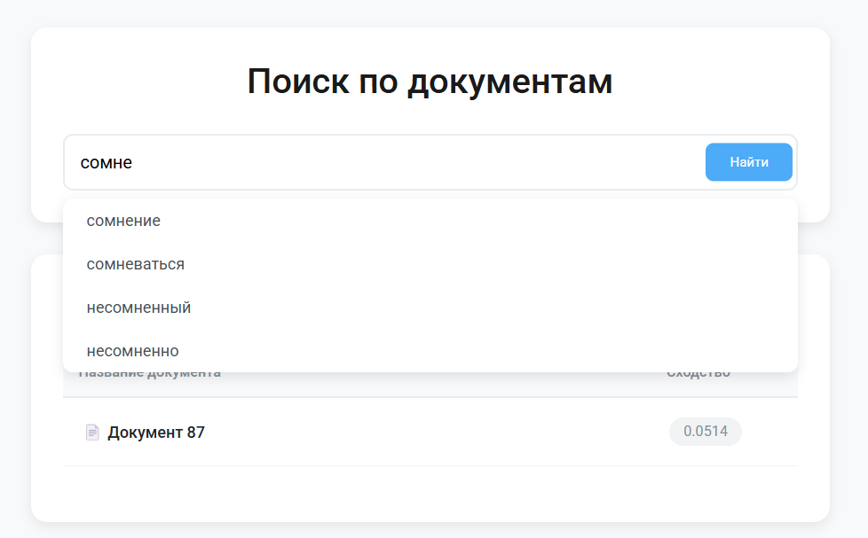

# 🔍 Basics of information search

Выполнили студенты группы 11-101:  
**Фаттахов Оскар** [@Houy3](https://t.me/Houy3) | **Гулиев Науруз** [@Nauruz7](https://t.me/Nauruz7)

---
## 📚 Задания

---

### 1. **Парсинг данных**  
**Файлы:**  
- [Код краулера](/Work1/ArticleCrawler.py) | [Архив документов](/Work1/result/article_list.zip)  
**Задача:** Скачать 100+ веб-страниц с сохранением HTML-разметки.

---

### 2. **Токенизация**  
**Файлы:**  
- [process_text.py](/Work2/process_text.py) | [tokens.txt](/Work2/result)  
**Задача:** Очистить текст от мусора и выделить уникальные токены.

---

### 3. **Инвертированный индекс**  
**Файлы:**  
- [boolean_search.py](/Work3/boolean_search.py) | [Генерация индекса](/Work3/build_inverted_index.py) | [Индекс](/Work3/result/inverted_index.txt)  
**Функционал:** Поиск с операторами `AND`, `OR`, `NOT`.

---

### 4. **Расчет TF-IDF**  
**Файлы:**  
- [tfidf_calculator.py](/Work4/tfidf_calculator.py)  
**Формат:** `<термин> <idf> <tf-idf>`.

---

### 5. **Векторный поиск**  
**Файлы:**  
- [vector_search.py](/Work5/vector_search.py)  
**Функционал:** Ранжирование документов по TF-IDF.

---

### 6. **Веб-интерфейс**  
**Файлы:**  
- [app.py](/Work6/app.py) | [index.html](/Work6/templates/index.html)  
**Функционал:** Поиск с выводом топ-10 результатов.

---

## 🚀 Инструкция по запуску веб-интерфейса

### 1. Установите зависимости
```bash
  pip install -r requirements.txt
```

### 2. Подготовьте данные
```
../Work1/result/article_list/      # Выкачанные документы (109.txt, 8.txt и т.д.)
../Work3/result/inverted_index.txt # Инвертированный индекс
../Work4/result/terms/             # TF-IDF файлы (109_terms.txt, 8_terms.txt)
```
### 3. Запустите сервер
```bash
  cd Work6
  python app.py
```
### 4. Откройте в браузере
```commandline
http://localhost:5000
```

### 🔧 Возможные проблемы

- **Ошибка "File not found"** → Проверьте пути к папкам Work1-4
- **Нет автодополнения** → Убедитесь, что папка ../Work4/result/terms содержит TF-IDF файлы

## 📸 Скриншот интерфейса

